## 模式识别课堂笔记

| 作者 | MagnetoWang                                                  |
| ---- | ------------------------------------------------------------ |
| 邮箱 | 暂无                                                         |
| 说明 | 根据模式识别这门课，梳理下内容，整理成笔记。                 |
| 注意 | 请不要用于商业用途。分享学习经验是种有趣的爱好。             |
| 参考 | 西电计算机学院的模式识别课堂ppt。                            |
| 最后 | 如果需要转载或者引用的话，请给个Star或者请标注一下我的github链接吧。https://github.com/MagnetoWang |
| Star | 给个Star吧，这样方便以后快速找到这个项目的位置并且查看最新修改的地方。 |
| Fork | 如果你有自己的想法，也可以fork这个项目。在遵守相关协议前提下，可以自行修改内容， |

### 概述
- 模式识别就是对模式的区分和认识
- 把对象根据其特征归到若干类别中适当的一类，因此模式识别也称为模式分类
- 对于复杂的模式除了分类还要描述其结构特征，如汉字识别和景物识别

#### 基本术语
- 样本：所研究对象的一个个体
- 样本集：若干样本的集合
- 类或类别：在所有样本上定义的一个子集，处于同一类的样本在我们所关心的性质上是不可区分的，即具有相同的模式
- 特征：用于表征样本的观测信息，通常是数值表示的，有时也称为属性；如果是高维则称为特征向量，样本的特征向量构成了特征空间，每个样本是特征空间中的一个点
- 已知样本：事先知道类别标号的样本
- 未知样本：类别标号未知，但特征已知的样本

#### 研究内容
- 目的：利用计算机对物理对象进行分类，在错误概率最小的条件下，使识别的结果尽量与客观物体相符合
- $Y=F(X)$
  - X的定义域取自特征集
  - Y的值域为类别 
  - F是模式识别的判别方法

#### 应用

- 机器视觉
- 语音识别
- 说话人身份确认
- 字符文字识别
- 石油探测
- 数据挖掘

#### 分类

- 监督模式
  - 邻近算法：KNN
  - 线性回归：Linear Regression
  - 逻辑回归：Logistic Regression
  - 支持/支撑向量机：Support Vector Machine
  - 朴素贝叶斯分类器：Naive Bayes
  - 决策树：Decision Tree
  - 随机森林：Random Forests
  - 神经网络：Neural Network
- 非监督模式
  - 给定的是未知样本集合，按其特征把相似的归位一类
  - 在工程合社会科学中出现较多，例如图像分割
  - 关键是如何定义两个特征向量之间的相似性，并选择一个合适的度量（metric)
  - K均值聚类（K-Means Clustering）
  - 模糊C均值算法（Fuzzy C-Means）
  - 谱聚类算法（Spectral Clustering）
  - 主成分分析算法（PCA)
  - 自组织映射神经网络（Self-Organizing Map,SOM）
  - 受限博尔兹曼机
- 半监督模式
  - 一般出现在系统设计者只能得到很少的已知样本的情况下
  - 带有约束条件的聚类
  - 强化学习
    - 基于评价的学习，不需要指明目标的类别，从状态到行为的映射的学习，其主要目标是最大化奖励或增强信号
    - 对学习者的正确行为进行奖励，反之惩罚其错误行为
  - Transductive SVM
  - Co-training（协同训练）
  - Label Propagation（图的标签传播算法）

### 概率函数应用
- 基础理论
- 重点考核内容

#### [贝叶斯决策理论](https://zh.wikipedia.org/wiki/%E6%9C%B4%E7%B4%A0%E8%B4%9D%E5%8F%B6%E6%96%AF%E5%88%86%E7%B1%BB%E5%99%A8)
- 准则函数
- 分类器
- 判别函数
- 决策面
- 正态分布的判别函数

##### 理论说明
- 贝叶斯统计决策理论是处理模式分类问题的基本理论之一，对模式分析和分类器（Classifier）的设计起指导作用。

##### 前提条件
- 各个类别的总体概率分布 (先验概率和类条件概率密度) 是已知的
- 要决策分类的类别数是一定的

##### 普遍的做法

- 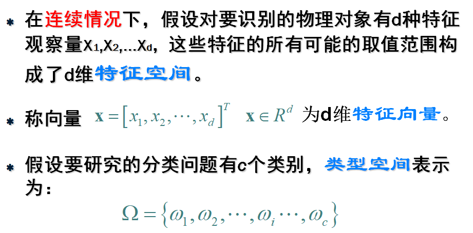

##### 常用的准则函数
- 最小错误率准则
- 最小风险准则
- Neyman-Pearson准则
- 最小最大决策准则
##### 最小错误率准则
- $p_e = \sum_{i = 1}^M \int_{R_i}\left(\sum_{j = 1}^M \lambda_{ki}p(x|\omega_{k})P(\omega_{k})\, \right)dx$
- 其中 ${\displaystyle p_{e}} $为错误率, ${\displaystyle x}$ 是测试样本. ${\displaystyle M}$ 为分类的类个数, ${\displaystyle R_{i}}$ 是 ${\displaystyle \omega _{i}}$ 所对应有着最大概率 ${\displaystyle p(x|\omega _{i})}$ 的区域, ${\displaystyle \lambda }$ 是一个参数矩阵 ${\displaystyle \lambda =1-I}$ 其中$ {\displaystyle I}$ 是单位矩阵.
- 先验概率 
  - $P(w_i)
  - 未获得观测数据之前类别的分布
- 类条件概率
  - $P(x|w_i)$
  - 观测数据在各类别种情况下的分布
- 后验概率
  - $P(w_i|x)$
  - X属于哪一类的概率
- 贝叶斯公式
  - $P(w_i|x)=\frac {P(x|w_i)P(w_i)} {P(x)}$
  - $P(x)=\sum_{i=1}^c P(x|w_i)P(w_i) $
- 图形化
  - 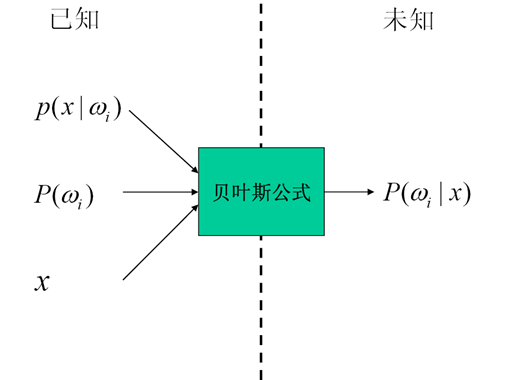
  - 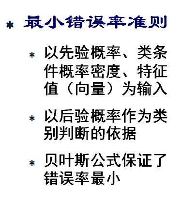

##### 最小风险准则
- 考虑各种错误造成损失不同而提出的一种决策规则
- 条件风险
  - 
- 期望风险
  - 对于x的不同观察值，采取决策αi时，其条件风险大小是不同的。所以究竟采取哪一种决策将随x的取值而定。这样，决策α可以看成随机向量x的函数，记为α(x)。可以定义期望风险$R_{exp}$
  - $R_{exp}=\int R(a(x)|x)p(x)dx$
  - 期望风险反映对整个空间上所有x的取值采取相应的决策α(x)所带来的平均风险。
- 归纳
  - 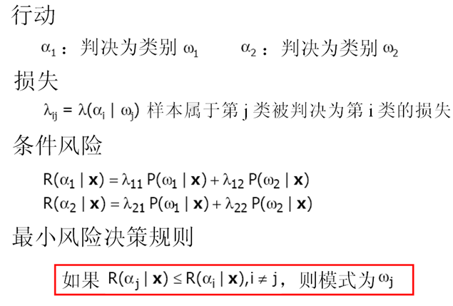
- 似然比公式
  - 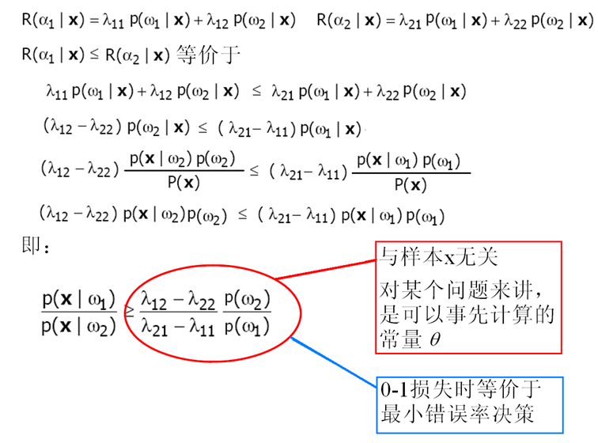
- 最小风险贝叶斯决策的步骤
  - 根据先验概率和类条件概率计算出后验概率
  - 利用后验概率和损失矩阵计算采取每种决策的条件风险
  - 比较各个条件风险的值，条件风险最小的决策即为最小风险贝叶斯决策
- 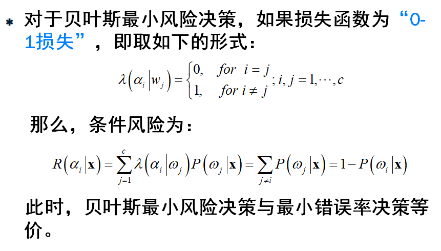

##### Neyman-Pearson准则

- 最小错误率准则 
  - 后验概率最大化，理论上错误率最小 
- 最小风险准则
	- 风险函数最小化，理论上总风险最小
- 问题
	- 先验概率和损失未知
	- 通常情况下，无法确定损失
	- 先验概率未知，是一个确定的值
	- 某一种错误较另一种错误更为重要
- 基本思想
	- 要求一类错误率控制在很小，在满足此条件的前提下再使另一类错误率尽可能小
	- 用lagrange乘子法求条件极值
- 

##### 最小最大决策准则
- Neyman-Pearson准则假定先验概率是一个确定的值，此时判定结果会受到先验概率的影响
- 实际中，类先验概率 $P(w_i) $往往不能精确知道或在分析过程中是变动的，从而导致判决域不是最佳的。所以应考虑如何解决在$ P(w_i)$ 不确知或变动的情况下使期望风险变小的问题
- 最小最大决策准则：在最差的条件下争取最好的结果，使最大风险最小！

#### 分类器，判别函数，决策面

#### 正态分布的判别函数 

#### Bayesian网络

### 概率密度函数的估计

### 线性分类器

- 实际中，常利用样本集直接设计分类器，而不是去估计类条件概率密度，即利用样本直接设计判别函数
- 线性判别函数假定判别函数$g(x)$是$x$的线性函数
- $g(x)=x^T+w_0$

#### 求解$w$和$w_0$

- 采用的分类器要满足设计要求
- 设计要求，在数学上，表现形式为某个特定准则函数

#### $Fisher$线性判别分析

- 输入
  - 数据集$D={((x_1,y_1),(x_2,y_2),,...,(x_m,y_m))}$
  - $x_i$为任意样本的n维向量
  - $y_i\in \{ C_1, C_2,C_3,...,C_k\}$，降维到维度d
- 输出
  - 降维后的样本集$D^`$
  - 计算类内散度矩阵$S_w$
  - 计算类间散度矩阵$S_b$
  - 计算矩阵$S_w^{-1}S_b$
  - 计算$S_w^{-1}S_b$的最大的d个特种值和对应的d个特征向量$(w_1,w_2,....,w_d)$，得到投影矩阵
  - 对样本集中的每一个样本特征$x_i$，转化为新的样本$z_i=W^Tx_i$
  - 得到输出样本基本集$D^`=\{(z_1,y_1), (z_2,y_2),...(z_m,y_m)\}$

#### 主成分分析法

#### 鲁棒主成分分析法(Robust PCA)

#### Laplacian Eigenmaps

#### 感知器

#### 支持向量机

#### 大间隔与推广能力

#### 多类线性分类器

#### 总结

### 其他分类方法

#### 近邻法

#### 罗杰斯特回归

#### 决策树与随机森林

#### Boosting方法

### 典型的集成学习算法介绍

#### Bagging

#### AdaBoost

### 选择性集成

### 特征选择和提取

### 人工神经网络 

- 人工神经网络是一个并行、分步处理系统，它由处理单元及其称为联接的无向讯号通道互连而成。
- 这些处理单元（PE-Processing Element）具有局部内存，并可以完成局部操作。
- 每个处理单元有一个单一的输出连接，这个输出可以根据需要被分枝成希望个数的许多并行联接，且这些并行联接都输出相同的信号，即相应处理单元的信号，信号的大小不因分支的多少而变化。
- 处理单元的输出信号可以是任何需要的数学模型，每个处理单元中进行的操作必须是完全局部的，也就是说，它必须仅仅依赖于经过输入连接到达处理单元的所有输入信号的当前值和存储在处理单元局部内存中的值。

总结
- 并行、分布处理结构。
- 一个处理单元的输出可以被任意分枝，并且大小不变。
- 输出信号可以是任意的数学模型。
- 处理单元完全的局部操作。

#### 人工神经网络描述包含8个要素
- 一组处理单元;
- 处理单元的激活状态;
- 每个处理单元的输出函数;
- 处理单元之间的联接模式；
- 传递规则；
- 把处理单元的输出与当前状态结合起来产生激活值的激活规则;
- 通过经验修改联接强度的学习规则；
- 系统运行的环境（样本集合）。

#### 信息的分布存放
- 信息的分布存放增强了网络的容错功能
	- 由于信息被分布存放在几乎整个网络中，所以，当其中的某一个点或者某几个点被破坏时，信息仍然可被存取。
- 系统在受到局部损伤时还可以正常工作
- 完成学习的网络并不能任意地进行修改
	- 对一类网络来说，当完成学习后，如果再让它学习新的东西，这时就会破坏原来已学会的东西。

#### 适应性（Applicability）问题
- 擅长两方面
	- 对大量的数据进行分类，并且只有较少的几种情况。
	- 必须学习一个复杂的非线性映射。
- 目前应用
	- 主要将其用于语音、视觉、知识处理、辅助决策等方面。
	- 在数据压缩、模式匹配、系统建模、模糊控制、求组合优化问题的最佳解的近似解（不是最佳近似解）等方面也有较好的应用。

#### 生物神经元的基本特性    
- 神经元及其联接
- 神经元之间的联接强度决定信号传递的强弱
- 神经元之间的联接强度是可以随训练改变的
- 信号可以是起刺激作用的，也可以是起抑制作用的
- 一个神经元接受的信号的累积效果决定该神经元的状态
- 每个神经元可以有一个阈值

#### 人工神经元结构
- 神经元是构成人工神经网络的最基本单元
- 人工神经元模型应该具有生物神经元的六个基本特性
- 人工神经元模拟了生物神经元的一阶特性。
- 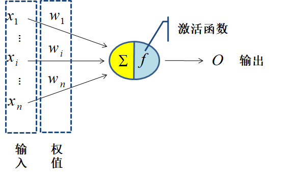

#### 人工神经网络基础
##### 主要激活函数
- 线性激活函数
- 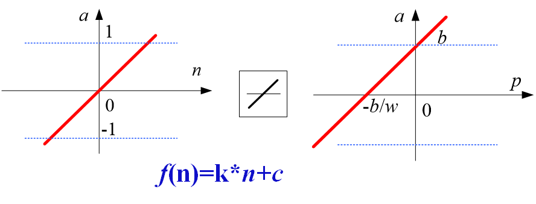
- 对数-S型激活函数
- 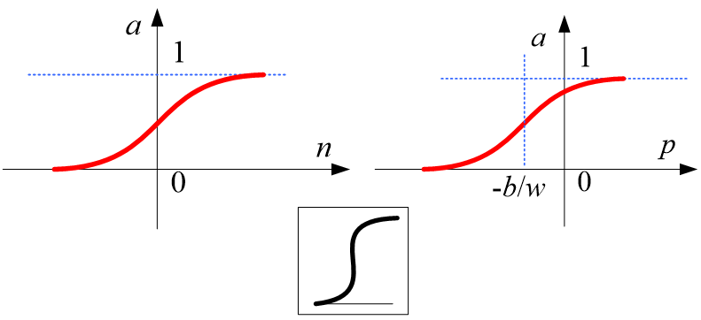

##### 激活函数总结
- 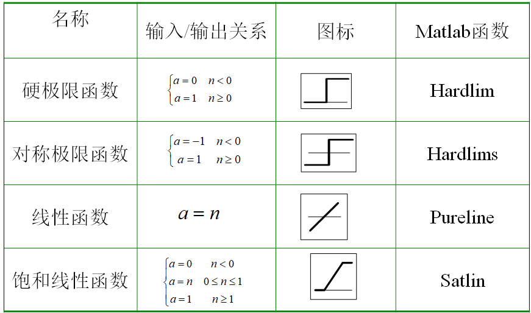
- 

##### 人工神经网络拓扑结构
- 人工神经网络由神经元模型构成
- 由许多神经元组成的信息处理网络具有并行分布结构
- 每个神经元具有单一输出，且能够与其它神经元连接
- 存在许多（多重）输出连接方法
- 人工神经网络的结构基本上分为两类：前馈网络和递归（反馈）网络

##### 前馈网络结构
- 前馈网络结构
- 前馈网络中的神经元只接受前一级的输入，并且只输出到下一级，同级节点不存在联接。从输入层至输出层的信号通过单向连接流通，不存在闭环结构。
- 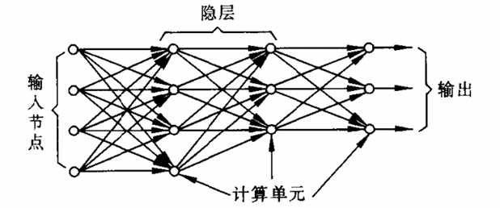

#####　反馈（递归）网络结构
- 反馈（递归）网络结构
- 在反馈网络中，多个神经元互连以组织一个互连神经网络。有些神经元的输出被反馈至同层或前层神经元。因此，信号能够从正向和反向流通。 

##### 人工神经网络的训练
- 神经网络主要通过有监督（有师）学习算法和非监督（无师）学习算法。此外，还存在第三种学习算法，即强化学习算法；可把它看做有师学习的一种特例。 
- 监督学习(Supervised learning)
	- 有监督学习算法能够根据期望的和实际的网络输出（对应于给定输入）间的差来调整神经元间连接的强度或权。因此，有监督学习需要有个老师或导师来提供期望或目标输出信号
	- 有监督学习算法的例子包括Delta规则、广义Delta规则或反向传播(BP)算法等。 
- 无监督学习(Unsupervised learning)
	- 无监督学习算法不需要知道期望输出。在训练过程中，只要向神经网络提供输入模式，神经网络就能够自动地适应连接权，以便按相似特征把输入模式分组聚集。
	- 无监督学习算法的例子包括自组织算法(SOM)和自适应谐振理论(ART)等。 
- 强化学习(Reinforcement Learning)
	- 强化（增强）学习是有监督学习的特例。它不需要老师给出目标输出。强化学习算法采用一个“评论员”来评价与给定输入相对应的神经网络输出的优度（质量因数）。
	- 强化学习算法的一个例子是AlphaGo。 

##### 感知器(Perceptron) 
- 感知器由两层神经元组成。输入层接受输入信号，输出层为“阈值逻辑单元”(threshold logical unit)。
-  感知器中的权值  $y=f(\sum w_ix_i -\theta)$ 和阈值  $\theta$   需要通过迭代的方法学习得到。 

