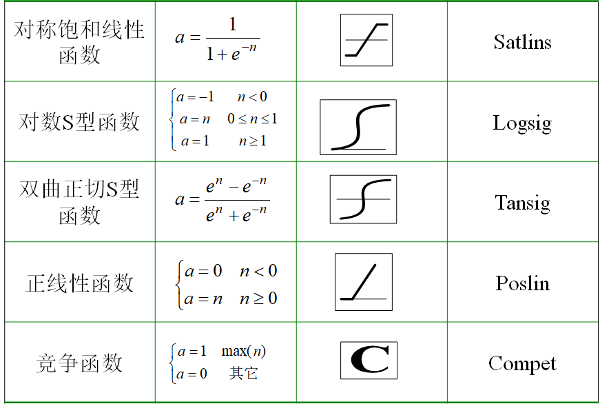

## 模式识别课堂笔记

| 作者 | MagnetoWang                                                  |
| ---- | ------------------------------------------------------------ |
| 邮箱 | 暂无                                                         |
| 说明 | 根据模式识别这门课，梳理下内容，整理成笔记。                 |
| 注意 | 请不要用于商业用途。分享学习经验是种有趣的爱好。             |
| 参考 | 西电计算机学院的模式识别课堂ppt。                            |
| 最后 | 如果需要转载或者引用的话，请标注一下我的github链接吧。https://github.com/MagnetoWang |

### 人工神经网络 

- 人工神经网络是一个并行、分步处理系统，它由处理单元及其称为联接的无向讯号通道互连而成。
- 这些处理单元（PE-Processing Element）具有局部内存，并可以完成局部操作。
- 每个处理单元有一个单一的输出连接，这个输出可以根据需要被分枝成希望个数的许多并行联接，且这些并行联接都输出相同的信号，即相应处理单元的信号，信号的大小不因分支的多少而变化。
- 处理单元的输出信号可以是任何需要的数学模型，每个处理单元中进行的操作必须是完全局部的，也就是说，它必须仅仅依赖于经过输入连接到达处理单元的所有输入信号的当前值和存储在处理单元局部内存中的值。

总结
- 并行、分布处理结构。
- 一个处理单元的输出可以被任意分枝，并且大小不变。
- 输出信号可以是任意的数学模型。
- 处理单元完全的局部操作。

#### 人工神经网络描述包含8个要素
- 一组处理单元;
- 处理单元的激活状态;
- 每个处理单元的输出函数;
- 处理单元之间的联接模式；
- 传递规则；
- 把处理单元的输出与当前状态结合起来产生激活值的激活规则;
- 通过经验修改联接强度的学习规则；
- 系统运行的环境（样本集合）。

#### 信息的分布存放
- 信息的分布存放增强了网络的容错功能
	- 由于信息被分布存放在几乎整个网络中，所以，当其中的某一个点或者某几个点被破坏时，信息仍然可被存取。
- 系统在受到局部损伤时还可以正常工作
- 完成学习的网络并不能任意地进行修改
	- 对一类网络来说，当完成学习后，如果再让它学习新的东西，这时就会破坏原来已学会的东西。

#### 适应性（Applicability）问题
- 擅长两方面
	- 对大量的数据进行分类，并且只有较少的几种情况。
	- 必须学习一个复杂的非线性映射。
- 目前应用
	- 主要将其用于语音、视觉、知识处理、辅助决策等方面。
	- 在数据压缩、模式匹配、系统建模、模糊控制、求组合优化问题的最佳解的近似解（不是最佳近似解）等方面也有较好的应用。

#### 生物神经元的基本特性    
- 神经元及其联接
- 神经元之间的联接强度决定信号传递的强弱
- 神经元之间的联接强度是可以随训练改变的
- 信号可以是起刺激作用的，也可以是起抑制作用的
- 一个神经元接受的信号的累积效果决定该神经元的状态
- 每个神经元可以有一个阈值

#### 人工神经元结构
- 神经元是构成人工神经网络的最基本单元
- 人工神经元模型应该具有生物神经元的六个基本特性
- 人工神经元模拟了生物神经元的一阶特性。
- 

#### 人工神经网络基础
##### 主要激活函数
- 线性激活函数
- 
- 对数-S型激活函数
- 

##### 激活函数总结
- 
- 

##### 人工神经网络拓扑结构
- 人工神经网络由神经元模型构成
- 由许多神经元组成的信息处理网络具有并行分布结构
- 每个神经元具有单一输出，且能够与其它神经元连接
- 存在许多（多重）输出连接方法
- 人工神经网络的结构基本上分为两类：前馈网络和递归（反馈）网络

##### 前馈网络结构
- 前馈网络结构
- 前馈网络中的神经元只接受前一级的输入，并且只输出到下一级，同级节点不存在联接。从输入层至输出层的信号通过单向连接流通，不存在闭环结构。
- 

#####　反馈（递归）网络结构
- 反馈（递归）网络结构
- 在反馈网络中，多个神经元互连以组织一个互连神经网络。有些神经元的输出被反馈至同层或前层神经元。因此，信号能够从正向和反向流通。 

##### 人工神经网络的训练
- 神经网络主要通过有监督（有师）学习算法和非监督（无师）学习算法。此外，还存在第三种学习算法，即强化学习算法；可把它看做有师学习的一种特例。 
- 监督学习(Supervised learning)
	- 有监督学习算法能够根据期望的和实际的网络输出（对应于给定输入）间的差来调整神经元间连接的强度或权。因此，有监督学习需要有个老师或导师来提供期望或目标输出信号
	- 有监督学习算法的例子包括Delta规则、广义Delta规则或反向传播(BP)算法等。 
- 无监督学习(Unsupervised learning)
	- 无监督学习算法不需要知道期望输出。在训练过程中，只要向神经网络提供输入模式，神经网络就能够自动地适应连接权，以便按相似特征把输入模式分组聚集。
	- 无监督学习算法的例子包括自组织算法(SOM)和自适应谐振理论(ART)等。 
- 强化学习(Reinforcement Learning)
	- 强化（增强）学习是有监督学习的特例。它不需要老师给出目标输出。强化学习算法采用一个“评论员”来评价与给定输入相对应的神经网络输出的优度（质量因数）。
	- 强化学习算法的一个例子是AlphaGo。 

##### 感知器(Perceptron) 
- 感知器由两层神经元组成。输入层接受输入信号，输出层为“阈值逻辑单元”(threshold logical unit)。
-  感知器中的权值  $y=f(-\theta)$ 和阈值  $\theta$   需要通过迭代的方法学习得到。 

